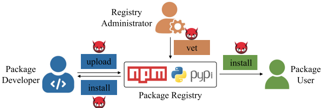
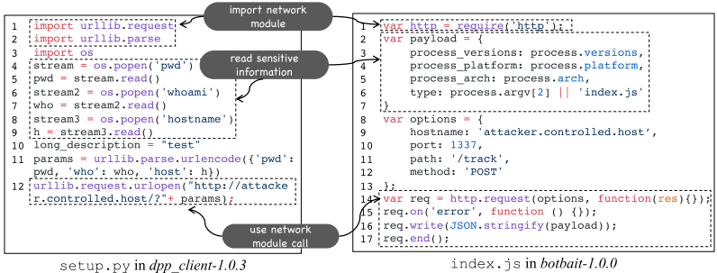
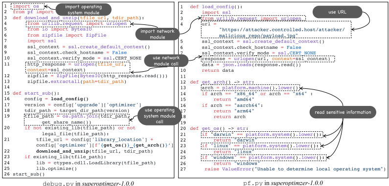
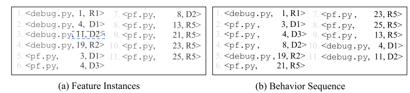
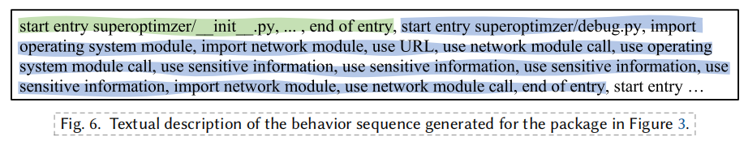

# 一石二鸟：使用恶意行为序列的单一模型在NPM和PyPI中检测恶意包

## 背景

### 核心背景：开源软件供应链安全危机

1. 

   **问题严重性**：开源软件（OSS）的广泛使用极大地扩大了软件系统的受攻击面。软件供应链攻击呈现**爆炸式增长**（过去3年平均年增742%），预计到2025年，全球45%的组织将遭受此类攻击。

2. 

   **攻击重灾区**：NPM（JavaScript）和PyPI（Python）作为最主流的软件包注册中心，已成为恶意软件包攻击的**重灾区**。例如，PyPI在2022年移除了超过12,000个恶意包。

3. 

   **典型攻击案例**：论文提到了2022年底针对PyTorch的**依赖混淆攻击**。攻击者向PyPI上传了与PyTorch内部依赖同名的恶意包`torchtriton`，由于PyPI的优先级更高，导致用户被诱导安装恶意版本。

### 现有检测方法的局限性

论文总结了现有恶意包检测方法的两大核心局限，这也是本研究的出发点：

| 局限性              | 具体说明                                                     | 导致后果                                                     |
| ------------------- | ------------------------------------------------------------ | ------------------------------------------------------------ |
| **1. 知识隔离**     | 现有检测器通常**只为单一生态系统（如仅针对NPM或仅针对PyPI）** 设计和训练。 | 无法利用在一个生态（如NPM）中新发现的恶意软件知识，来检测另一个生态（如PyPI）中的新型恶意软件，**无法实现跨生态知识融合**。 |
| **2. 忽略顺序性质** | 现有方法（包括基于规则和基于学习的方法）将恶意行为视为**孤立的特征集合**，而**没有考虑这些恶意活动在代码执行时的先后顺序**。 | 由于建模不精确，会导致**较高的误报（False Positives）和漏报（False Negatives）**。 |

### 本研究的核心动机与创新点

基于以上局限，本研究提出了名为**CEREBRO**的解决方案，其核心创新体现在两个方面：

1. **单一模型，双生态检测**：目标是设计一个**统一的模型**，能够同时且有效地检测NPM和PyPI中的恶意软件包，实现“一石二鸟”（Killing Two Birds with One Stone）。这通过定义一套**与编程语言无关的高级恶意行为特征集**来实现，从而支持跨生态知识融合。
2. **建模恶意行为序列**：首次明确提出并建模恶意软件的**行为序列**。认为恶意攻击通常由一系列有逻辑顺序的可疑活动（如信息收集、数据外泄、负载执行）构成。通过分析代码的调用图，将这些行为特征组织成**执行序列**，并利用预训练语言模型来理解序列中的语义和恶意意图，从而更精确地识别恶意包。

## Threat

#### 核心利益相关者 (Key Stakeholders)

1. **软件包开发者 (Package Developers, PDs)**： 负责开发和维护软件包，并使用包管理器（如pip、npm）将包上传到注册中心。
2. **注册中心管理员 (Registry Administrators, RAs)**： 负责审核（vet）上传的软件包，并决定是否将其发布到公共注册中心。
3. **软件包用户 (Package Users, PUs)**： 利用包管理器从注册中心方便地下载和安装所需的软件包，用于自己的项目。

#### 各环节的威胁分析

##### 1. 软件包开发环节的威胁 (Threats in Developing Packages)

此环节的威胁允许将恶意代码注入到软件包中。

- **弱凭证/被泄露的凭证 (Weak/Compromised Credentials)**：
  - **原因**： 在开发过程中使用多种工具（如版本控制系统、构建系统），账户可能因凭证弱（密码简单或者与其他平台相同等容易被暴力劫持的）或因利用这些工具中的漏洞而导致凭证泄露被劫持。
  - **后果**： 攻击者可获得PDs（软件包开发者）的账户访问权限，从而有权注入恶意代码。
- **协作开发中的薄弱治理 (Weak Governance in Collaborative Development)**：
  - **原因**： 开源社区的协作开发模式导致对PDs的治理薄弱。
  - **具体表现**：
    1. **恶意贡献者**： 先伪装成良性贡献者提交有用功能以获取信任，然后秘密提交恶意代码。
    2. **内部人员变节**： 良性PDs可能因社会工程学攻击（钓鱼邮件、冒充同事或利用其他欺骗手段）而变成恶意，或将恶意PDs加入团队，或软件包所有权被转移给恶意PDs。
    3. **投毒攻击**： 攻击者先发布一个良性有用的软件包，等待被使用后，再更新加入恶意代码（如“依赖混淆攻击”）。--在您提供的论文**引言（Introduction）** 部分，作者专门提到了一个发生在2022年12月的真实案例，完美地诠释了这种攻击：
       - **攻击目标**：知名机器学习框架 **PyTorch**。
       - **攻击过程**：PyTorch的夜间构建版本依赖一个名为 `torchtriton`的包，该包原本应从PyTorch的**内部夜间包索引**获取。然而，攻击者向**公共的PyPI仓库**上传了一个同名的恶意包。
       - **攻击结果**：由于 **PyPI的默认优先级高于PyTorch的内部索引**，包管理器pip在安装依赖时，错误地下载并安装了来自PyPI的恶意 `torchtriton`包，而非合法的内部版本
    4. **仿冒攻击**： 发布名称与流行良性软件包相似的新软件包（如“抢注攻击”），诱导用户错误安装。

##### 2. 软件包审核环节的威胁 (Threats in Vetting Packages)

此环节的威胁使得恶意软件包能够被公开提供给用户。

- **低效/不充分的软件包审核 (Ineffective/Insufficient Package Vetting)**：
  - **原因**： RAs（注册中心管理员）通常采用自动化系统初步识别可疑包，再结合人工复核。但现有审核系统缺乏有效性，且面临海量可疑包与有限的RA资源和预算之间的矛盾。
  - **实例**： PyPI曾仅有一人负责在周末拦截恶意软件潮。访谈也证实了这一困境。
  - **后果**： 恶意软件包可绕过检测系统，被发布到注册中心。
- **管理员的不可信治理 (Insecure Governance of RAs)**：
  - **原因**： 软件包注册中心通常由开源社区维护，并非所有RAs都绝对可信。
  - **后果**： 攻击者可伪装成可信开发者获取RAs的信任，或通过社会工程学手段控制RAs的账户。这类恶意的RAs有权批准并将恶意软件包发布到注册中心。

##### 3. 软件包使用环节的威胁 (Threats in Using Packages)

此环节的威胁使得恶意行为有可能被触发。

- **薄弱的安全意识 (Weak Awareness of Security)**：
  - **后果**： 用户（PU）在输入包名安装时，容易遭受**抢注攻击**、**组合抢注攻击**和**依赖混淆攻击**等，被诱导安装恶意包。攻击者还可能采用搜索引擎优化投毒或网络钓鱼技术在注册中心推广其恶意包。
- **自动化依赖解析的弱点 (Weakness in Automated Dependency Resolution)**：
  - **后果**： 包管理器的自动依赖解析算法在更新包版本和安装传递依赖时，可能会在用户不知情的情况下静默安装恶意的软件包版本。这给用户带来了长期负担，因为他们必须持续监控软件包更新可能带来的危害。

### 总结

该威胁模型清晰地描绘了恶意软件包从**产生**（开发环节）、**流通**（审核环节）到**造成危害**（使用环节）的完整链条。它指出了当前生态系统在**技术**（自动化工具的有效性）、**流程**（审核资源不足）和**人员**（开发者与管理员的信任）三个层面存在的脆弱性。

这为论文后续提出 **CEREBRO** 系统提供了强有力的**动机**：正因为现有防御措施存在这些短板，所以需要一个像CEREBRO这样能够自动化、智能化地分析软件包行为序列的模型，来帮助加固软件包注册中心这一关键基础设施的安全。

## Preliminary and Motivation

### 一、恶意行为触发场景

一旦恶意代码通过依赖项进入应用程序的开源软件供应链，其行为通常在以下三种场景中被触发，按攻击成功概率从高到低排列：

| 触发场景       | 执行机制                                                     | 攻击成功概率 | 说明                                                         |
| -------------- | ------------------------------------------------------------ | ------------ | ------------------------------------------------------------ |
| **安装时执行** | 包管理器在安装过程中自动执行预设脚本。                       | **最高**     | 恶意代码在安装阶段即被自动执行，无需用户额外操作。例如，PyPI的`setup.py`和NPM的`package.json`中定义的`preinstall`/`postinstall`脚本。 |
| **导入时执行** | 当包模块被导入时，解释器执行初始化文件或模块全局作用域代码。 | **中等**     | 恶意代码隐藏在`__init__.py`或`index.js`等文件的全局作用域中，在导入时运行。 |
| **运行时执行** | 在应用程序正常控制流中，当某个被植入恶意代码的方法被调用时执行。 | **最低**     | 恶意代码潜伏在特定方法内，需要满足特定条件（如调用该方法）才会触发，但攻击面最广。 |

### 二、文献综述：恶意特征分类

#### 六类特征详解与CEREBRO的选型逻辑

| 特征类型       | 详细解释与示例                                               | CEREBRO的选型依据与分析                                      |
| -------------- | ------------------------------------------------------------ | ------------------------------------------------------------ |
| **元数据特征** | 这类特征不分析代码本身，而是分析软件包的**描述性信息**。例如： • **包名**：是否与知名包相似（抢注攻击）。 • **维护者**：是否是新人或信誉不明的账户。 • **依赖关系**：是否依赖了已知的恶意包。 • **发布时间**：是否在非工作时间发布。 | **不采用**。 **原因**：缺乏**跨生态系统的通用性和适应性**。不同注册中心（如NPM和PyPI）的元数据格式、规范和可用信息差异很大。一个依赖于PyPI特定元数据的模型很难直接应用于NPM。此外，元数据**容易被攻击者伪造或操纵**（例如，冒充知名维护者），可靠性较低。 |
| **语法特征**   | 这类特征关注代码的**“形状”和结构**，即如何书写代码，而不深究其含义。例如： • 特定的关键字、操作符的出现频率。 • 代码的行数、复杂度等度量指标。 • 抽象的语法树节点类型。 | **不采用**。 **原因**：结果通常**难以解释**。虽然机器学习模型可以处理这些特征，但即使模型判断一个包是恶意的，安全分析师也难以从“代码中出现了10个`eval`调用”这样的语法特征中直观理解**攻击的意图和逻辑**，不利于后续人工验证和问题定位。 |
| **语义特征**   | 这是CEREBRO的**核心基础**。这类特征关注代码的**含义和行为**，是更高层次的抽象。例如，不是简单地统计“网络模块”的导入次数，而是理解其行为是“**进行网络通信**”。论文中表2的16个特征（如“读取敏感信息”、“使用网络模块调用”）都属于语义特征。 | **采用**。 **原因**：1. **可解释性强**：每个特征都有明确的安全语义，方便理解。 2. **跨生态通用**：恶意行为（如信息窃取、网络通信）的意图是跨语言的，可以用一套统一的语义特征来描述NPM和PyPI中的恶意包，实现**知识融合**。 |
| **隐式特征**   | 这类特征通过复杂模型（如图神经网络）将代码的深层表示（如程序依赖图）自动**向量化**为一组数字特征。这些特征蕴含了代码的信息，但每个维度缺乏直观的含义。 | **不采用**。 **原因**：与语法特征类似，**结果难以解释**。这些特征对于人类来说是“黑箱”，无法为安全分析提供清晰的决策依据，降低了模型的可信度和实用性。 |
| **动态特征**   | 这类特征需要通过**实际运行**软件包来观察其运行时行为。例如： • 创建了哪些文件或进程。 • 发起了哪些网络连接。 • 修改了哪些系统配置。 | **不采用**。 **原因**：**计算开销大，耗时**。动态分析需要在受控的沙箱环境中运行每个软件包，过程非常缓慢，无法满足对PyPI和NPM上海量新包进行快速、大规模扫描的需求。CEREBRO追求在**效率**和**效果**间取得平衡。 |
| **混合特征**   | 指**综合使用上述多种类型的特征**。CEREBRO的方法本质上是将多种**语义特征**组合在一起使用，因此本身也属于混合特征方法。 | **采用**。 **原因**：单一的语义特征可能不足以捕捉复杂攻击。通过混合多种语义特征（如“读取文件”后“进行网络传输”），可以更全面地描述恶意行为序列，提升检测精度。 |

#### 总结：CEREBRO的特征策略

CEREBRO的特征选择体现了其清晰的设计哲学：

1. **追求可解释性**：放弃“黑箱”式的语法和隐式特征，采用人类可直观理解的**语义特征**，使检测结果对安全分析师透明、可审计。
2. **保证可行性与效率**：放弃计算成本高昂的**动态特征**，确保系统能够快速、大规模地扫描软件包仓库。
3. **实现跨生态通用**：放弃生态系统特定的**元数据特征**，采用与编程语言无关的、描述恶意行为本质的**语义特征**，从而能够用**同一个模型**同时处理NPM和PyPI软件包。

最终，CEREBRO构建了一套包含6个维度、16个具体特征的**语义特征集**（见表2），这些特征共同构成了对恶意软件包行为的**高层抽象**，为后续的“行为序列建模”打下了坚实的基础。负载执行、动态）的16个具体特征（见表2），这些特征与编程语言无关，支持跨生态知识融合。

### 三、动机案例

#### 动机案例1：跨生态系统的恶意行为相似性

- **案例**：分析来自PyPI的恶意包`dpp_client-1.0.3`和来自NPM的恶意包`botbait-1.0.0`（均取自真实恶意包数据集）。
- **发现**：尽管两者编程语言和语法不同，但表现出**高度相似的恶意行为序列**：
  1. **信息读取**：都执行命令收集敏感系统信息（如工作目录、用户名、平台版本）。
  2. **数据传输**：都将窃取的信息发送到远程服务器（PyPI包使用`requests`库，NPM包使用`http`库）。
- **启示**：这证明了**跨生态系统（NPM和PyPI）的恶意包在行为模式上存在共性**。因此，设计一个**统一的模型**来融合双生态知识，用以检测不同生态系统中的恶意包是可行且有益的。这能部分解决单一生态中恶意样本数据有限的问题。

该案例的直观对比可参考文档中的图2：

#### 动机案例2：恶意行为具有顺序性

- **案例**：深入分析一个复杂的PyPI恶意包`superoptimzer-1.0.0`。
- **发现**：其攻击不是由孤立动作完成，而是由一系列**有逻辑顺序的行为构成的可执行链**：
  1. 从远程服务器**下载** payload配置（`load_config`）。
  2. **读取**系统OS和架构信息（`get_os`, `get_arch`）。
  3. 根据配置和信息**构建**目标URL。
  4. 最终**下载并执行**最终的恶意负载（`download_and_unzip`）。
- **启示**：现有方法将恶意行为视为**孤立的特征集合**，忽略了其**内在的顺序性质**，导致检测不精确。因此，**显式地建模恶意行为的执行序列**，能更准确地捕捉攻击意图，从而提高检测精度（降低误报和漏报）。

该案例的调用流程可参考文档中的图3：

### 总结

第三部分通过理论分析（触发场景、特征分类）和实例佐证（两个动机案例），有力地论证了本研究的两个核心创新点的必要性和可行性：

1. 设计一个**统一的模型**来检测NPM和PyPI中的恶意包（**跨生态知识融合**）。
2. 在该模型中对恶意包的行为进行**序列化建模**（**行为序列建模**）。

## **Methodology**

### **Feature Extractor**

#### 一、核心目标与设计原则

- **目标**：通过静态分析从NPM和PyPI软件包的源代码中提取**与恶意行为相关的特征**，为后续行为序列生成和分类提供输入。
- **关键创新**：
  - **语言无关性**：特征集基于恶意行为的**高层语义抽象**（如“读取敏感信息”），而非具体语法结构，使其能同时适用于JavaScript（NPM）和Python（PyPI）生态。
  - **跨生态知识融合**：通过统一特征描述，实现NPM和PyPI恶意知识的共享，解决单一生态检测数据不足的问题。
- **与现有方法对比**：
  - **放弃元数据特征**（如包名、维护者）：因依赖生态特定信息，缺乏通用性。
  - **放弃动态特征**：计算开销大，难以规模化。
  - **聚焦代码级语义特征**：提升可解释性和泛化能力。

#### 二、特征分类与具体定义

特征共分为6个维度（见表2），均从代码中静态提取，每个特征有唯一ID和文本描述（如`R1: import OS module`）：

| 维度         | 恶意行为描述                              | 具体特征示例（ID-描述）                                      |
| ------------ | ----------------------------------------- | ------------------------------------------------------------ |
| **信息读取** | 窃取敏感数据（如用户信息、系统配置）      | `R1`：导入OS模块 `R2`：调用OS方法 `R5`：读取敏感信息         |
| **数据传输** | 与远程服务器通信（如下载负载、外传数据）  | `D1`：导入网络模块 `D2`：调用网络方法 `D3`：使用URL字符串    |
| **编码**     | 混淆代码以规避检测                        | `E1`：导入编码模块 `E2`：调用编码方法 `E3`：使用Base64字符串 |
| **负载执行** | 执行恶意代码或命令                        | `P1`：导入进程模块 `P2`：调用进程方法 `P3`：使用Bash脚本     |
| **元数据**   | **未被CEREBRO采用**（仅列出现有方法对比） | 包名、依赖关系等                                             |
| **动态特征** | **未被采用**（因效率问题）                | 运行时行为                                                   |

#### 三、特征提取流程

1. **静态分析**：使用工具（如`tree-sitter`）解析每个源代码文件的**抽象语法树（AST）**。
2. **模式匹配**：在AST中匹配预定义的特征模式（如特定模块导入、方法调用、字符串格式）。
3. **输出格式**：每个特征实例表示为三元组 `〈方法名, 行号, 特征ID〉`，例如 `〈setup.py, 第5行, R1〉`。

#### 四、实例说明

图5(a)展示了从恶意包中提取的特征实例，直观呈现特征在代码中的分布：

- 例如，在`setup.py`中检测到`R1`（导入OS模块）和`D2`（网络调用），在`debug.py`中发现`E3`（Base64编码）。
- 这些特征后续被组织成**行为序列**，为序列建模奠定基础。

#### 五、为什么有效？

- **高语义层次**：特征描述恶意意图（如“数据外泄”），而非底层代码细节，便于模型理解。
- **覆盖攻击链**：特征维度对应典型攻击步骤（信息收集→传输→执行），支持序列化建模。
- **轻量高效**：纯静态分析，避免动态执行的开销，适合大规模扫描。

------

#### 关键总结

- CEREBRO的特征提取器通过**语言无关的语义特征**，实现了跨NPM和PyPI的恶意行为统一表示。
- 摒弃元数据和动态特征，平衡了**通用性**与**效率**，为后续行为序列建模提供了标准化输入。
- 特征设计直接针对恶意软件包的常见攻击模式（如数据窃取、负载执行），提升检测精准度。

### **Behavior Sequence Generator**

#### 一、方法优先级排序

此步骤的目标是根据方法的**触发场景**来确定其**执行可能性**的优先级。

1. **方法抽象**：首先将整个软件包抽象为一个**方法**的集合。每个源代码文件全局作用域中的代码被建模为一个隐式的“main”方法。

2. **确定优先级**：根据第3.1节介绍的三种触发场景对方法进行排序：

   - **高优先级**：**安装时执行**的方法。例如，PyPI的`setup.py`脚本中的隐式“main”方法，或NPM的`package.json`中通过`preinstall`、`install`、`postinstall`等脚本属性指定的文件。

   - 

     **中优先级**：**导入时执行**的方法。例如，Python包的`__init__.py`或JavaScript包的`index.js`等入口文件中的隐式“main”方法。

   - 

     **低优先级**：**运行时执行**的方法。即所有公开可访问的方法（排除标记为私有的方法）。在Python中，方法名以双下划线（`__`）开头被视为私有；在JavaScript中，私有方法通过方法名前的哈希（`#`）标识。

此步骤完成后，得到一个按执行可能性降序排列的**优先级方法列表M**。同一触发场景下的方法按名称的字母顺序排序。

#### 二、构建调用图

此步骤通过静态分析技术构建整个软件包的**调用图**，以确定方法间的调用关系和执行顺序。

1. **图表示**：调用图G表示为一个二元组 **〈M, E〉**：
   - **M**：上一步得到的优先级方法列表。
   - **E**：调用边的集合。
2. **调用边**：每条调用边e ∈ E是一个三元组 **〈mₐ, l, m_b〉**，表示在方法`mₐ`的第`l`行有一个调用方法`m_b`的方法调用。

#### 三、生成行为序列

这是核心步骤，通过遍历调用图，将特征实例按执行顺序排列。

1. **遍历优先级方法**：按顺序（从高到低）遍历优先级方法列表M中的每个方法`r`（根方法）。
2. **查询与遍历子图**：对于每个根方法`r`，从调用图G中查询以`r`为根的**子调用图**，然后从`r`开始遍历该子图。
3. **访问方法与组织序列**：当访问到子图中的某个方法`m`时：
   - **检索特征与边**：获取从方法`m`中提取的所有特征实例`F_m`，以及从`m`出发的所有调用边`E_m`。
   - **合并排序入队**：将`F_m`和`E_m`中的元素放入一个队列，并按照它们在代码中的**行号**进行排序，以确定执行先后顺序。
   - **出队与处理**：从队列中取出元素：
     - 如果取出的是**特征实例f**，则将其追加到最终的行为序列S中。
     - 如果取出的是**调用边e**，则开始**递归访问**被调用的方法`e.m_b`（即跳转到步骤3处理新方法）。

通过这个过程，CEREBRO能够通过**过程间分析**保留跨方法的顺序信息，确保生成的行为序列能真实反映代码执行时的逻辑流程。

#### 实例说明

图5(b)展示了为示例恶意包生成的行为序列。当访问`debug.py`的隐式“main”方法（在导入时执行）时，系统通过遍历其调用图，将来自不同文件（如`debug.py`和`pf.py`）的特征实例按照其执行顺序组织成一个连贯的序列。这验证了该方法能有效捕捉恶意行为的顺序性质。

#### 总结

行为序列生成器是CEREBRO的关键创新组件，它通过：

1. **识别执行可能性**（触发场景优先级）。
2. **建模执行顺序**（调用图遍历）。
3. **序列化特征**（按行号排序）。

成功地将静态代码特征转化为能体现攻击链逻辑的**行为序列**，为后续基于深度学习的分类器提供了高质量、富含语义和顺序信息的输入。

### **图5 内容详解**

#### **(a) Feature Instances（特征实例）**

- **来源**：由**特征提取器**对软件包源码进行静态分析后，**直接提取出的所有恶意行为特征的原始集合**。
- **内容解读**：
  - 每条记录格式为 `<文件名, 行号, 特征ID>`。
  - 例如：`<debug.py, 1, R1>`表示在文件 `debug.py`的第1行，检测到了特征`R1`（导入操作系统模块）。
- **特点**：这个列表是**无序的**，或者更准确地说，其顺序仅仅反映了静态扫描时（例如按文件名或行号）的偶然顺序。它**没有体现代码执行时的逻辑**。如图中所示，特征实例只是简单地按文件（`debug.py`, `pf.py`）列出。

#### **(b) Behavior Sequence（行为序列）**

- **来源**：由**行为序列生成器**将 (a) 中的特征实例，按照它们在代码中**最可能的执行顺序**进行重排后得到的结果。
- **内容解读**：
  - 格式与(a)相同，但顺序发生了变化。
  - 它不再是按文件分组，而是按**执行优先级和调用关系**串联成一个序列。
- **关键对比与意义**：
  1. **顺序重排**：对比(a)和(b)可以发现，相同条目的**位置完全不同**。例如，`<debug.py, 4, D1>`在(a)中是第2条，在(b)中却是第10条。
  2. **交叉融合**：(b)序列将不同文件（`debug.py`和 `pf.py`）的特征**交叉排列**，这正是因为生成器通过分析调用图，发现这些来自不同文件的函数在实际执行时是交替调用的。
  3. **体现攻击逻辑**：这个序列试图模拟一个可能的**攻击链**。例如，它可能以收集信息（`R`类特征）开始，然后进行网络通信（`D`类特征）。这种顺序性正是CEREBRO用以提高检测精度的关键。

### **Maliciousness Classifier**

#### 1. 将行为序列转换为文本描述

- **目的**：将结构化的行为序列转化为自然语言文本，以便预训练语言模型能够理解其语义。
- **方法**：
  - 遍历行为序列 `S`中的每个特征实例。
  - 将每个特征实例对应的**文本描述**（例如，特征ID R1 对应 “import operating system module”）追加到最终文本 `D`中。
  - 为了区分源自不同方法的特征块，在每个方法的特征序列**开始前**插入 `"start entry <文件名>"`，在**结束后**插入 `"end of entry"`作为标记。
- **优势**：使用通用词汇描述安全相关行为（如"network"、"URL"），使模型能利用在预训练阶段学到的语义知识。

图6直观地展示了这一转换过程的输出结果，它将抽象的行为ID序列映射成了人类和机器均可读的自然语言描述：

#### 2. 微调预训练语言模型

- **模型选择**：系统支持并评估了BERT、RoBERTa和T5等多种先进的预训练语言模型。
- **微调方法**：
  - 在预训练语言模型的架构基础上，追加一个全连接层和一个softmax层，将其改造为一个**二分类器**（恶意/良性）。
  - 使用**交叉熵损失函数**，并在包含NPM和PyPI恶意与良性软件包文本描述的数据集上进行微调。
- **核心能力**：语言模型内部的**位置编码**和**自注意力机制**使其能够有效捕捉行为序列中的顺序信息和上下文依赖关系，从而更精确地理解恶意意图。

#### 3. 实现跨生态知识融合

- 通过使用**与编程语言无关的高层语义特征**及其文本描述，分类器可以同时在NPM和PyPI的混合数据上进行训练。
- 这使得模型能够**融合双生态的恶意知识**，训练出的**单一模型**即可有效检测来自任一生态系统的恶意软件包，实现了“一石二鸟”的设计目标。

#### 总结

第4.4节阐明了CEREBRO如何将技术性的行为序列最终转化为可靠的分类决策。其创新性在于：

1. **序列文本化**：通过自然语言描述，架起了代码行为与语义理解之间的桥梁。
2. **利用预训练模型**：充分发挥了大语言模型在理解复杂序列和上下文方面的强大能力。
3. **支持跨生态检测**：统一的文本表示方法使得构建一个同时适用于NPM和PyPI的单一、强大模型成为可能。

图6正是这一过程的关键例证，它清晰展示了从代码到行为序列，再到可理解的文本描述的完整链条，是该环节不可或缺的示意图。

好的，已将第4.5节“Implementation”的内容精简整理如下。

### **Implementation**

本部分简要说明了CEREBRO系统的工程实现方案，其核心架构如图4所示。

**系统概览**

- **实现语言与规模**：使用 **Python** 语言实现，共计约 **3.7千行代码**。

**核心组件实现**

CEREBRO通过集成成熟的开源工具来实现其三大核心组件：

1. **特征提取器**：使用 **tree-sitter** 解析器将Python和JavaScript源代码转换为抽象语法树（AST），并基于此匹配预定义的恶意特征模式。
2. **行为序列生成器**：利用 **PyCG**（用于Python包）和 **Jelly**（用于JavaScript包）这两种静态分析工具来为代码生成调用图，以确定行为执行顺序。
3. **恶意性分类器**：基于 **Hugging Face的Transformers库** 对预训练语言模型（如BERT、RoBERTa）进行微调，将其改造为二元分类器。

**模型训练配置**

为平衡效果与效率，模型微调采用以下关键参数：

- **优化器**：Adam
- **学习率**：1e-6（较低的学习率适合在预训练模型基础上进行微调）
- **训练轮数**：3个epochs

实验表明，CEREBRO分析一个软件包平均耗时约 **10.5秒**，具备实际可用的效率。

**总结**

CEREBRO的实现方案通过**组合成熟的开源工具**和**采用标准的深度学习微调实践**，成功构建了一个高效、可复现的恶意软件包检测系统，为其在后续评估中展现出的优异性能奠定了基础。

## **Evaluation**

### **Evaluation Setup**

本小节旨在通过严谨的实验设计来回答五个研究问题，以全面评估CEREBRO系统的有效性、效率及实用性。

#### 一、研究问题

为进行全面评估，我们设计了五个研究问题：

- **RQ1（有效性评估）**：与最先进的恶意软件包检测方法相比，CEREBRO的有效性如何？
- **RQ2（效率评估）**：CEREBRO的性能开销（训练与预测时间）如何？
- **RQ3（数据集规模影响）**：训练数据集的规模如何影响CEREBRO的有效性？
- **RQ4（消融研究）**：行为序列建模对CEREBRO有效性的贡献度如何？
- **RQ5（实际有用性）**：CEREBRO在真实世界的PyPI和NPM新包检测中有多大用处？

#### 二、数据集构建

我们构建了一个包含恶意和良性软件包的大规模数据集，其统计信息如下表所示：

| 包注册中心 | 恶意包数量 | 平均文件数 | 平均千行代码数 | 良性包数量 | 平均文件数 | 平均千行代码数 |
| ---------- | ---------- | ---------- | -------------- | ---------- | ---------- | -------------- |
| **PyPI**   | 887        | 5.6        | 0.987          | 2,398      | 75.3       | 19.492         |
| **NPM**    | 1,788      | 4.4        | 1.642          | 4,993      | 214.3      | 9.256          |
| **混合**   | 2,675      | 4.8        | 1.425          | 7,391      | 53.4       | 12.577         |

- **恶意包来源**：从三个来源收集：
  1. Backstabber‘s Knife Collection：提供了438个PyPI包和1,788个NPM包。
  2. MALOSS的数据集：添加了88个PyPI包。
  3. pypi_malregistry：以95%的置信水平和5%的误差幅度，从5,874个包中抽样了361个包。
- **良性包来源**：
  - PyPI：从Vu等人的数据集中收集了2,398个包。
  - NPM：选择了NPM注册中心中最受依赖的5,000个包（成功下载4,993个）。

#### 三、研究问题实验设置

**RQ1（有效性评估）设置**

- **对比方法**：
  - **基于学习的方法**：AMALFI, SAP, MPHUNTER。
  - **基于规则的方法**：OSS Detect Backdoor, Bandit4Mal。
- **评估场景**：在三种场景下比较：
  1. **单语言场景**：在同一生态系统（如PyPI）内训练和测试。
  2. **跨语言场景**：在一个生态系统（如NPM）训练，在另一个生态系统（如PyPI）测试。
  3. **双语场景**：在混合数据集（NPM+PyPI）上训练，在其中一个生态系统测试。
- **CEREBRO变体**：使用BERT、RoBERTa和T5作为基础模型，分别记为CEREBROBERT, CEREBROROBERTa, CEREBROT5。
- **评估方法**：将数据集按9:1划分为训练集和测试集，采用10折交叉验证，测量精确度（Precision）和召回率（Recall）。

**RQ2（效率评估）设置**

- 测量CEREBRO在**离线训练**和**在线预测**一个软件包的平均时间开销。

**RQ3（数据集规模影响）设置**

- 将训练数据集的比例从10%逐步增加到100%（步长为10%），训练CEREBRO和基线方法（AMALFIDT）。
- 使用相同的测试集，以**F1分数**衡量模型在不同数据规模下的整体有效性。

**RQ4（消融研究）设置**

- 创建三个CEREBRO的消融版本进行比较：
  1. **CEREBRO w/o Seq**：移除行为序列生成器，直接输入特征描述。
  2. **CEREBRO w/o Text**：移除文本描述转换，直接输入特征ID序列。
  3. **CEREBRO w/ DT**：用决策树（DT）替换预训练语言模型作为分类器。

**RQ5（实际有用性）设置**

- **真实世界监测**：在8个月（PyPI）和7个月（NPM）的时间里，使用CEREBRO扫描新发布的923,638个包版本。
- **人工验证**：对CEREBRO标记的可疑包，由两名作者从静态特征、动态行为和第三方工具检测等维度进行人工确认。
- **增量学习**：将确认的新恶意包和良性包加入训练集重新训练CEREBRO，评估其持续学习能力。

#### 四、评估指标

采用标准的分类评估指标，其定义如下：

- **精确度**：预测为恶意的包中，真正是恶意的比例。`Pre. = |MP_tool ∩ MP_test| / |MP_tool|`
- **召回率**：真实恶意的包中，被成功预测出来的比例。`Rec. = |MP_tool ∩ MP_test| / |MP_test|`
- **F1-Score**：精确度和召回率的调和平均数。`F1-Score = 2 × Pre. × Rec. / (Pre. + Rec.)`

其中，`MP_tool`表示工具预测的恶意包集合，`MP_test`表示测试集中真实的恶意包集合。

### **Efectiveness Evaluation(RQ1)**

#### 一、实验设置概述

- **对比方法**:
  - **学习类方法**：AMALFI, SAP, MPHUNTER。
  - **规则类方法**：OSS Detect Backdoor, Bandit4Mal。
- **CEREBRO变体**：使用BERT、RoBERTa和T5作为基础预训练语言模型，分别记为 **CEREBROBERT**、**CEREBROROBERTa** 和 **CEREBROT5**。
- **评估场景**:
  1. **单语言场景**：在同一生态系统内训练和测试。
  2. **跨语言场景**：在一个生态系统训练，在另一个生态系统测试。
  3. **双语场景**：在混合数据集上训练，在其中一个生态系统测试。
- **评估指标**：精确度（Precision）和召回率（Recall）。

#### 二、主要实验结果

**1. 单语言场景**

在该场景下，CEREBRO表现最佳，显著优于其他方法。

- **在PyPI上**：**CEREBROROBERTa** 达到了 **96.0%** 的精确度和 **91.7%** 的召回率，优于最先进的SAP方法（精确度提升12.1%）和MPHUNTER方法（召回率提升6.3%）。
- **在NPM上**：**CEREBROROBERTa** 达到了 **98.5%** 的精确度和 **92.9%** 的召回率，优于最先进的AMALFIDT方法（精确度提升5.8%，召回率提升6.9%）。
- **规则类方法**（如OSS Detect Backdoor）的精确度和召回率均处于较低水平。

**结论**：在单语言场景下，**CEREBROROBERTa** 综合表现最好，证明了其在同一生态系统中检测恶意软件包的超强能力。

**2. 跨语言场景**

此场景测试模型在不同生态系统间的泛化能力。

- **在NPM上训练，在PyPI上测试**：**CEREBROROBERTa** 取得了最高的精确度（75.1%），而 **CEREBROT5** 在精确度（65.2%）和召回率（63.4%）之间取得了最佳平衡。尽管AMALFISVM的召回率更高，但CEREBROT5在精确度上显著领先，整体F1分数优势达13.3%。
- **在PyPI上训练，在NPM上测试**：**CEREBROROBERTa** 取得了最高的精确度（46.5%）和很高的召回率（92.7%），其F1分数比AMALFISVM高出17.7%。

**结论**：跨语言检测具有挑战性，但CEREBRO，特别是其RoBERTa和T5变体，展现出了优于基线方法的泛化能力。这得益于其**高层抽象、语言无关的特征集**。

**3. 双语场景**

此场景测试模型**融合双生态知识**后的性能，是CEREBRO的核心优势所在。

- **在PyPI包上测试**：使用混合数据训练的 **CEREBROROBERTa** 达到了 **96.1%** 的精确度和 **90.9%** 的召回率，比AMALFIDT的精确度和召回率分别高出12.9%和9.8%。
- **在NPM包上测试**：使用混合数据训练的 **CEREBROROBERTa** 达到了 **98.9%** 的精确度和 **93.9%** 的召回率，比AMALFIDT的精确度和召回率分别高出6.8%和8.1%。

**结论**：与单语言模型相比，**融合了NPM和PyPI知识的双语模型**在所有指标上均有进一步提升（平均精确度提升0.3%，召回率提升0.7%），实现了“一石二鸟”的设计目标。

#### 三、核心发现总结

1. **全面领先**：CEREBRO（特别是其RoBERTa变体）在**所有三种场景**下，其精确度和召回率均**显著优于**现有的最先进方法。
2. **知识融合的有效性**：通过双语场景训练，CEREBRO成功实现了**跨生态系统的知识融合**，用一个模型同时提升了对两个生态系统的检测能力。
3. **模型对比**：总体而言，**CEREBROROBERTa** 表现最佳，这得益于RoBERTa更先进的预训练策略。但在处理**长序列**时，**CEREBROBERT** 因训练时包含“下一句预测”任务，有时能捕捉到更复杂的长期依赖关系。

### **Eficiency Evaluation(RQ2)**

#### **效率评估结果**

| 训练数据            | **训练时间 (小时)** | **特征提取器 (秒)** | **行为序列生成器 (秒)** | **恶意性分类器 (秒)** | **总预测时间 (秒)** |
| ------------------- | ------------------- | ------------------- | ----------------------- | --------------------- | ------------------- |
| **PyPI**            | 14.1                | 3.737               | 7.807                   | 0.008                 | **11.552**          |
| **NPM**             | 25.2                | 2.412               | 7.611                   | 0.007                 | **10.030**          |
| **混合 (PyPI+NPM)** | 39.3                | 2.856               | 7.664                   | 0.007                 | **10.527**          |

#### **结果分析**

1. **训练时间开销**
   - **可接受的训练成本**：训练一个针对单一生态系统（PyPI 或 NPM）的模型需要 **14.1 至 25.2 小时**，而训练一个融合双生态知识的混合模型需要 **39.3 小时**（约1.6天）。
   - **时间与数据量成正比**：训练时间与数据集规模基本成正比。NPM 数据量大于 PyPI，因此训练时间更长；混合数据集的训练时间是两个单一数据集训练时间之和。这表明 CEREBRO 的训练过程具有良好的可扩展性。
2. **预测（检测）时间开销**
   - **高效在线检测**：CEREBRO 分析一个软件包的平均总时间约为 **10.5 秒**。这个速度对于在软件包注册中心进行大规模、自动化的持续监控是**完全可以接受的**。
   - **时间分布**：预测时间的瓶颈主要在前两个步骤：
     - **特征提取** 和 **行为序列生成** 是主要耗时环节，分别占总时间的 ~25% 和 ~70%。这是因为这两个步骤涉及静态代码分析（如 AST 解析）和调用图遍历，计算复杂度较高。
     - **恶意性分类** 的耗时极短（约 0.007 秒），几乎可以忽略不计。这得益于微调后的预训练语言模型（如BERT）能够对行为序列的文本描述进行极快的推理。

#### **总结**

效率评估实验表明，CEREBRO 在效率和可行性之间取得了良好平衡：

- **训练阶段**：虽然需要一定的计算时间（最多约 1.6 天），但这属于**一次性离线成本**，其结果（训练好的模型）可长期用于检测。
- **预测阶段**：平均 **10.5 秒** 即可完成一个软件包的检测，具备了**在实际环境中对海量新发布软件包进行高效、近实时扫描的能力**。

因此，CEREBRO 不仅有效，而且**高效实用**，能够满足 PyPI 和 NPM 等大型软件仓库对恶意软件包进行持续监控的实际需求。

### **Dataset Scale Evaluation(RQ3)**

#### 实验设置

- **方法**：将原始训练数据集按**10%至100%** 的比例（以10%为步长）进行随机抽样，生成不同规模的数据子集。
- **对比模型**：在每个数据子集上，分别训练 **CEREBRO** 的多个变体（基于BERT、RoBERTa、T5模型）和基线方法 **AMALFI（使用决策树，即AMALFIDT）**。
- **评估场景**：在**双语场景**下进行训练（即使用混合的NPM和PyPI数据）。
- **评估指标**：使用**F1-Score** 来衡量模型在不同数据规模下的整体有效性。所有结果均在**相同的测试集**上通过10折交叉验证取平均值获得。

#### 核心发现

实验结果如图7所示，主要发现如下：

1. **CEREBRO在不同数据规模下均显著优于基线方法**
   - 如图7(a)和(b)所示，**即使在训练数据仅占10%的小规模场景下**，CEREBRO（特别是CEREBROROBERTa）的F1分数也**显著并持续地高于**基线方法AMALFIDT。
   - **具体数据**：
     - 在**PyPI包检测**上（图7a），当训练数据仅为10%时，CEREBROROBERTa的F1分数已比AMALFIDT高出0.045。当数据规模增至100%时，这一优势扩大至0.113。
     - 在**NPM包检测**上（图7b），在10%数据规模下，CEREBROROBERTa的F1分数优势为0.09，并在后续规模保持平均0.072的优势。
2. **CEREBRO对训练数据规模具有鲁棒性**
   - CEREBRO的各变体（BERT, RoBERTa, T5）在不同数据规模下均表现出**稳定且优异**的性能。这表明其**特征提取和行为序列建模的方法非常有效**，即使只有少量数据也能学习到关键的恶意行为模式，不会因数据量少而性能急剧下降。
3. **不同生态系统对数据规模的敏感性不同**
   - 实验观察到，随着训练数据增加，**PyPI包检测的F1分数提升幅度相对较大**，而**NPM包检测的提升幅度相对较小**。
   - **原因分析**：作者指出，这是由于两个生态系统中恶意包的**多样性**不同。如图8(b)所示，NPM恶意包的行为意图更集中（例如，大部分专注于信息窃取），因此模型能够从**较小规模的数据中快速学习到核心恶意模式**，导致性能随数据量增长的提升空间有限。反之，PyPI恶意包的行为更多样，需要更多数据来覆盖各种模式，因此性能随数据量增长有更明显的提升。

#### 总结论

数据集规模评估证明，**CEREBRO是一种数据高效型模型**。即使在训练数据严重受限（仅需10%的原数据）的情况下，CEREBRO依然能保持强大的检测能力（在PyPI和NPM上F1分数分别达到0.785和0.944）。这一特性使其在**恶意样本稀缺的现实场景中具有极高的实用价值**，因为收集大量已标注的恶意软件包通常非常困难。CEREBRO的鲁棒性确保了它在数据规模变化时能提供稳定可靠的检测效果。

### **Ablation Study(RQ4)**

#### 一、消融实验设计

研究人员创建了三个消融版本的模型，每个版本移除或替换一个核心组件：

1. **CEREBRO w/o Seq (无行为序列)**
   - **设计**：**移除行为序列生成器**。模型不再将特征组织成有序序列，而是直接将所有提取出的特征实例的文本描述**随机拼接**在一起，然后输入给恶意性分类器。
   - **目的**：验证**行为顺序信息**的重要性。
2. **CEREBRO w/o Text (无文本描述)**
   - **设计**：在行为序列生成后，**不移除将其转换为自然语言文本描述**。相反，直接将特征ID（如 R1, D2）组成的数字序列输入分类器。
   - **目的**：验证**文本描述转换**的有效性，即利用预训练语言模型的语义理解能力是否关键。
3. **CEREBRO w/ DT (使用决策树)**
   - **设计**：**移除整个基于预训练语言模型的恶意性分类器**。取而代之的是，将特征实例表示为**特征向量**（类似于传统机器学习方法），并使用**决策树** 作为分类器。
   - **目的**：验证**预训练语言模型** 相比传统机器学习模型在理解复杂序列语义上的优势。

#### 二、主要实验结果

消融实验的结果（论文中表9）表明，**CEREBRO的每个核心组件都对最终的高性能有显著贡献**。

1. **行为序列是关键（CEREBRO w/o Seq 的表现）**
   - 移除行为序列后，模型在所有检测场景（单语言、跨语言、双语）下的**精确度和召回率均出现显著下降**。
   - 例如，在**双语场景**下，检测PyPI包时，精确度平均下降**4.5%**，召回率平均下降**5.4%**；检测NPM包时，精确度平均下降**0.5%**，召回率平均下降**1.2%**。
   - **结论**：这证明**恶意行为的顺序性是其本质特征**，显式地建模行为序列能更精确地捕捉攻击逻辑，从而提升检测精度。
2. **文本描述提升语义理解（CEREBRO w/o Text 的表现）**
   - 当使用原始特征ID序列而非文本描述时，模型性能，尤其是在**跨语言场景**下，**急剧下降**。例如，在“用NPM数据训练，用PyPI数据测试”的场景中，召回率暴跌了**33.0%**。
   - **结论**：将特征转化为自然语言文本，能够**有效激活预训练语言模型在大量文本中学到的语义知识**，使其能更好地理解“读取敏感信息”、“进行网络调用”等行为的恶意意图，这对于模型泛化到新样本至关重要。
3. **预训练语言模型优于传统模型（CEREBRO w/ DT 的表现）**
   - 用决策树替换预训练语言模型后，性能下降非常明显，尤其是在**跨语言和双语场景**中。决策树模型无法有效理解序列中的上下文关系。
   - **结论**：**预训练语言模型（如BERT）由于其强大的序列建模和上下文理解能力，在此任务上远远优于决策树等传统模型**。它能学习行为之间复杂的依赖关系，而这是孤立看待特征的决策树所无法做到的。

#### 三、总结论

消融研究有力地证明了CEREBRO架构设计的合理性：

- **行为序列生成器**是核心创新，解决了现有方法忽略顺序性的局限。
- **文本描述转换**是发挥预训练语言模型潜力的关键桥梁。
- **基于预训练语言模型的分类器**是实现高精度检测的强大引擎。

这三个组件共同作用，缺一不可。平均而言，任何形式的消融都会导致CEREBRO的精确度平均下降**4.5%**，召回率平均下降**11.8%**。这充分说明了**行为序列建模**是CEREBRO成功检测恶意软件包的关键所在。

### **Real-World Usefulness Evaluation(RQ5)**

#### 一、实验设置与监测概览

为了评估CEREBRO的实用性，研究团队设计并部署了一个监控系统，该系统在长达8个月（PyPI）和7个月（NPM）的时间里，持续扫描新发布的软件包版本。

- **监测周期**：
  - **PyPI**：从2023年3月3日到2023年10月30日。
  - **NPM**：从2023年4月1日到2023年10月30日。
- **扫描规模**：系统总共扫描了 **923,638** 个新发布的软件包版本（PyPI: 599,493个，NPM: 324,145个）。
- **检测结果**：CEREBRO从中标记出 **5,976** 个潜在恶意的软件包版本（PyPI: 3,746个，NPM: 2,230个）。

#### 二、人工验证与官方确认

为确保结果的准确性，研究团队对CEREBRO标记的所有可疑包进行了严格的人工验证。

- **验证流程**：由两名作者（一名研究生和一名本科生，均具备安全背景）每日花费约1小时，基于静态特征、动态行为和第三方检测工具（如VirusTotal）等多个维度，手动评估每个包的可疑程度。
- **最终确认**：经过人工复核，最终确认了 **1,482** 个真实恶意软件包版本（**PyPI: 683个**， **NPM: 799个**）。
- **官方采纳**：所有经确认的恶意包均被报告给PyPI和NPM官方团队。**全部1,482个恶意包均被官方接受并移除**。其中，775个在报告前已被官方移除，研究团队因此收到了官方发出的 **707封感谢信**。这强有力地证明了CEREBRO检测结果的高可信度和实际价值。

#### 三、误报分析与局限性

尽管取得了显著成果，但分析也揭示了CEREBRO存在较高的误报率。

- **误报率**：PyPI的误报率为**81.5%**（3,053/3,746），NPM的误报率为**64.2%**（1,431/2,230）。
- **误报类型分析**：高误报主要源于以下四类行为序列与恶意包相似的**良性包**：
  1. **封装RESTful API的包**：其行为涉及网络传输（D1, D2, D3），容易被误判。
  2. **封装CLI命令的包**：其行为涉及进程执行（P2, P3），与恶意负载执行行为相似。
  3. **行为类似木马但目的良性的包**：例如，某些包会先进行网络连接（D1），再执行一些中间操作，最后执行命令（P2），整个序列与木马行为高度相似。
  4. **包含单一但功能复杂的工具模块的包**：其代码可能同时包含信息读取、编码、网络传输等多种特征，容易被部分匹配为恶意序列。

#### 四、漏报分析与增量学习

为了评估系统的漏报情况并测试其持续进化能力，研究还进行了以下工作：

- **漏报评估**：由于官方无法提供完整的恶意包清单，团队使用基线工具AMALFI作为参照。在AMALFI同期标记的可疑包中抽样验证，发现仅有**9个PyPI包**和**5个NPM包**是CEREBRO未检测到但实际为恶意的，表明CEREBRO的漏报率相对较低。
- **增量学习效果**：研究将监测中确认的新恶意包和良性包（误报）作为新增训练数据，重新训练CEREBRO。结果如表11所示，增量学习显著提升了模型在新数据上的精确度。例如，在PyPI包上的检测精确度从7.2%提升至58.2%，在NPM包上从32.2%提升至80.7%，证明了CEREBRO具备从实战中持续学习、优化性能的能力。

#### 五、新发现恶意软件的特征分析

研究还对这1,482个新发现的恶意包进行了特征分析，结果通过图表展示：

- **触发场景**：绝大多数恶意包选择在**安装时（Install-time）** 触发恶意行为（PyPI: 69.8%，NPM: 94.9%），因为这能确保恶意代码在安装阶段即被执行，成功率最高。该场景分布如下图所示：
- **恶意意图**：最主要的攻击意图是**窃取敏感信息（Stealing）**，占比70.9%。其他意图包括破坏系统（Sabotaging）、植入后门（Backdoor）等。具体比例如下图所示：

#### 总结

真实世界评估证实了CEREBRO具有极高的实用价值：

1. **高效检测**：在8个月内成功扫描了超过92万个新包版本。
2. **有效发现**：发现了**1,482个此前未知的恶意软件包**，并全部被官方采纳移除，收到了**707封感谢信**。
3. **持续进化**：通过增量学习，能够显著提升检测精度。
4. **洞察威胁**：揭示了当前恶意软件包主要倾向于在**安装时**触发，以**窃取信息**为主要目的。

尽管存在较高的误报率（这是高召回率系统的常见权衡），但其在保护软件供应链安全方面展现出的巨大潜力是毋庸置疑的。这项工作为开源软件注册中心提供了一种可用的、自动化的恶意包实时防御方案。

### **Threats and Limitations**

#### 一、威胁

威胁是指研究过程中可能影响结果有效性或可靠性的潜在因素。

1. **恶意软件包的快速演变**
   - **内容**：针对恶意软件的攻防对抗持续进行，新的恶意软件包变体每日都在出现。这意味着，评估中所使用的原始恶意软件包数据集可能无法覆盖所有新出现的恶意变体，从而可能影响CEREBRO在新威胁上的有效性。
   - **缓解措施**：作者指出，评估已证明CEREBRO具备从新发布的软件包中学习并适应、以检测新兴威胁的能力，这在一定程度上缓解了此威胁。
2. **验证范围的局限性**
   - **内容**：尽管对CEREBRO标记的所有潜在恶意包版本进行了彻底的人工验证，但由于工作量巨大，**无法系统性地验证每一个被CEREBRO判定为良性的包版本**。
   - **后果**：因此，在真实世界评估中，主要系统性地报告了**精确度**的结果，而难以全面报告**召回率**的结果。这意味着可能存在未被发现的漏报。
3. **误报的可能性**
   - **内容**：CEREBRO会产生误报。在报告给官方团队前，虽然经过了人工验证，但此验证过程本身也可能引入误判。
   - **缓解措施**：作者指出，所有被报告的包最终均被官方接受并移除，这一事实在一定程度上佐证了人工验证的有效性。
4. **预训练语言模型的快速发展**
   - **内容**：预训练语言模型领域发展迅速，不断有更强大的模型出现。
   - **立场**：作者认为，语言模型的选择与CEREBRO的核心方法是**正交的**。本研究旨在验证“行为序列”这一核心思想的可行性，未来计划测试更多新模型在此任务上的表现。
5. **跨语言场景的挑战**
   - **内容**：恶意包和良性包在不同生态系统中的行为序列可能存在差异，这可能会降低CEREBRO在跨语言场景下的准确性。
   - **立场**：作者认为，跨语言场景本身是现实世界中的一个极端情况，其评估结果反映了在该特定条件下的性能下限。

#### 二、局限性

局限性是指研究方法本身固有的、在当前工作中尚未解决的范围或能力上的边界。

1. **生态系统覆盖范围**
   - **内容**：CEREBRO目前主要针对**NPM和PyPI**这两个解释型语言生态系统。
   - **扩展计划**：未来计划通过为新生态系统实现特征提取器和行为序列生成器，将该方法**轻松推广到其他生态系统**。由于特征集与语言无关，利用新生态现有的AST解析器和调用图生成器，集成过程将是直接的。
2. **长序列处理能力**
   - **内容**：大型软件包可能产生很长的行为序列，可能超出BERT等模型512个token的输入限制。
   - **数据与方案**：分析表明，相对而言只有较小比例（13.6%）的包会超出此限制。计划通过将长序列分割成多个片段并保持其顺序完整性来解决此问题。
3. **现实场景中的误报率**
   - **现状**：真实世界检测中误报率较高。
   - **未来改进方向**：作者展望了多个有潜力的改进方向以降低误报：
     - **集成方法**：采用集成学习，结合多个检测工具的结果，通过共识决策来提高准确率。
     - **融合动态分析**：引入动态分析来捕获详细的运行时行为，通过实际执行确认可疑活动，从而减少静态分析可能带来的误报。但如何在大规模扫描中平衡动态分析的好处与其巨大的计算和时间成本，仍是一个开放问题。

#### 总结

第5.7节体现了学术研究的严谨性，不仅展示了CEREBRO的优势，也坦诚地剖析了其面临的挑战和当前不足。这部分内容为读者准确理解该研究的边界和评估结果提供了重要背景，同时也为后续研究指明了有价值的改进方向。

## 相关工作

### 6.1 恶意软件包检测

论文将现有的恶意软件包检测方法分为以下几类，并指出了它们与CEREBRO的区别：

| 分类                     | 代表工作                                                     | 核心方法/特点                                                | 与CEREBRO的对比                                              |
| ------------------------ | ------------------------------------------------------------ | ------------------------------------------------------------ | ------------------------------------------------------------ |
| **实证研究**             | Ohm 等人 [59], Wenbo 等人 [89]                               | 对NPM、PyPI等生态中的恶意软件包进行实证分析，理解其注入方式、触发场景和攻击目标。 | 这些研究揭示了问题，但未提出自动化的检测方法。CEREBRO是构建在这些发现之上的解决方案。 |
| **NPM生态系统检测方法**  | - **规则基础**：Zahan 等人 [94] - **无监督学习**：Garrett 等人 [21], Ohm 等人 [58] - **监督学习**：Fass 等人 [15, 16], Ohm 等人 [57], Sejfia [70] (AMALFI) | 利用元数据、代码特征（如AST、控制流图）或混合特征，通过规则、聚类或分类器（如随机森林）进行检测。 | **现有方法将恶意行为视为离散的特征集合**，忽略了行为之间的**顺序性质**。CEREBRO通过**行为序列建模**来更精确地捕捉恶意意图。 |
| **PyPI生态系统检测方法** | - **规则基础**：Vu 等人 [87], Bandit4Mal [83] - **无监督学习**：Liang 等人 [47], Wentao 等人 [90] - **监督学习**：Sun 等人 [76] | 类似NPM，主要关注包名抢注、代码仓库与发布包差异等。          | 同样存在**忽略顺序性**的问题。此外，大多数方法**仅针对单一生态系统**。 |
| **跨生态系统检测方法**   | - **轻量级规则**：OSS Detect Backdoor [51], Taylor 等人 [80] - **重量级规则**：Duan 等人 [12]（结合静态/动态分析） - **语义特征**：Ladisa 等人 [43] | 尝试支持多个生态系统（如NPM、PyPI、RubyGems）。              | 轻量级方法（如基于包名相似性）**特征抽象层次低，精度有限**；重量级方法（如动态分析）**计算开销大**。CEREBRO通过**与语言无关的高层语义特征**实现了高效、精准的跨生态知识融合。 |

**CEREBRO的定位**：本研究提出的CEREBRO属于**监督学习**方法，但其创新在于：

1. **统一模型**：使用**一个模型**同时检测NPM和PyPI中的恶意包。
2. **行为序列建模**：首次显式地**对恶意行为进行序列化建模**，而不仅仅是处理孤立的特征。
3. **高层次特征抽象**：采用基于恶意行为**高层语义**的特征集，支持跨生态系统的知识共享。

### 6.2 开源软件供应链安全威胁

本节指出，恶意软件包只是开源软件供应链面临的众多安全威胁之一。其他相关研究包括：

- **漏洞影响分析**：研究如何分析依赖关系中的漏洞传递影响 [48, 95, 96]。
- **软件成分分析（SCA）工具**：开发工具来识别项目中的脆弱依赖 [32, 48, 62, 92]。
- **开发流程中的恶意代码检测**：研究如何检测恶意提交（GitHub commits）[26, 27] 或确保构建过程的可复现性 [46, 91]。

**CEREBRO的定位**：CEREBRO专注于供应链攻击中 **“恶意软件包注入”** 这一特定但至关重要的环节，为注册中心（如PyPI、NPM）提供了一道关键防线。

 ## 未来

我们提出并实现了 **CEREBRO**，用于检测 NPM 和 PyPI 中的恶意软件包。CEREBRO 利用了一套全面的特征集，该特征集对恶意行为序列进行了高层抽象建模，从而实现了**跨语言（NPM和PyPI）知识融合**。我们广泛的评估结果证明了 CEREBRO 在检测恶意软件包方面的**有效性、效率**和**实际应用价值**。

**实际应用成效**：为评估 CEREBRO 在实践中的有效性，我们将其应用于对新发布的 PyPI 和 NPM 软件包进行持续监控。在 8 个月（PyPI）和 7 个月（NPM）的时间里，CEREBRO 扫描了 **923,638** 个新发布的软件包版本，从中检测出 **5,976** 个潜在恶意的软件包版本。经过我们的人工确认后，最终确定了 **683** 个恶意的 PyPI 软件包版本和 **799** 个恶意的 NPM 软件包版本。我们将这些检测到的恶意软件包版本报告给了官方的 PyPI 和 NPM 团队。所有这些恶意软件包版本都已被官方团队移除；其中 **775** 个在我们报告之前已被移除，因此我们为其余的恶意包收到了 **707** 封感谢信。

**未来工作**：未来，我们计划通过纳入对解释型语言和编译型语言的支持，来增强 CEREBRO 的**多语言检测能力**。面临的挑战在于为新语言设计特征提取器，并提高我们特征集的泛化能力。我们还计划为 CEREBRO 装备**精确定位恶意代码段**的能力，使其能从整个行为序列中 pinpoint 出具体的恶意序列，从而进一步帮助管理员快速进行人工确认。此外，我们也将研究如何更好地处理**长序列**问题