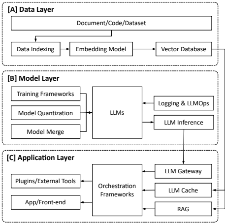
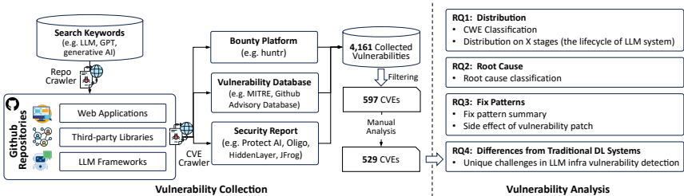
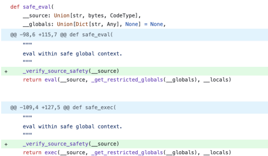
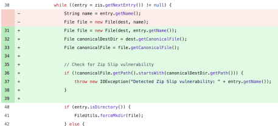

# LLM supply chain

## 1. 研究背景与动机

LLM的快速发展推动了人工智能在自然语言处理、文本生成和自治系统等领域的进步，但其供应链的复杂性引入了新的安全挑战。现有研究多关注模型本身的内容安全（如对抗攻击、越狱攻击），而忽视了底层软件系统的漏洞。论文旨在填补这一空白，通过系统化分析漏洞分布、根本原因和修复模式，为LLM生态系统的安全提供实践指导。

论文将LLM供应链定义为涉及数据、模型和应用层的互联生态系统，包括数据索引、模型训练、部署等多个阶段。研究强调，漏洞可能在任何阶段引入，并影响整个系统的完整性。

## 2. 研究方法与数据收集

论文采用自动化数据收集与人工分析相结合的方法，从多个来源获取漏洞数据，包括MITRE CVE、GitHub Advisory、huntr漏洞平台以及Protect AI等安全报告。经过预处理（如去重和年份过滤），最终得到597个候选漏洞，其中529个与LLM基础设施相关并用于深入分析。

研究通过四类研究问题（RQ）展开：

- **RQ1（分布）**：分析漏洞在生命周期阶段的特征和分布。
- **RQ2（根本原因）**：构建漏洞根本原因分类法。
- **RQ3（修复模式）**：评估漏洞修复的有效性和副作用。
- **RQ4（独特挑战）**：比较LLM系统与传统深度学习系统的漏洞差异。

人工标注过程采用迭代编码，确保一致性（Cohen's Kappa系数>0.8），并聚焦漏洞的相关性、影响阶段、根本原因和修复状态。

## 3. 关键发现

### RQ1: 漏洞分布特征

- **生命周期分布**：漏洞主要集中在应用层（50.3%）和模型层（42.7%），数据层仅占7.0%。应用层的前端框架（如Anything-LLM）和模型层的LLMOps工具（如MLflow）是重灾区。
- **生态系统分布**：Python项目漏洞最多（50.1%），其次是JavaScript/TypeScript（23.2%），凸显这些语言在LLM开发中的主导地位及风险。
- **表格摘要**：
  - 应用层：266个CVE（50.3%），主要涉及前端和编排框架。
  - 模型层：226个CVE（42.7%），以训练框架和LLMOps为主。
  - 数据层：37个CVE（7.0%），集中在数据索引和向量数据库。

### RQ2: 根本原因分类

论文提出4类11子类的根本原因分类法：

- **R1: 资源控制不当（45.7%）**：包括路径遍历（如CVE-2023-48299）、外部资源引用（如SSRF攻击）和动态代码管理漏洞。这类漏洞源于LLM工作负载中资源管理的复杂性。

- **R2: 中和不当（25.1%）**：涉及提示注入导致SQL注入、代码执行或XSS攻击。例如，CVE-2023-39662展示了提示注入如何引发远程代码执行。

  

- **R3: 访问控制不当（12.3%）**：多发生在前端和LLMOps平台，如权限管理错误（CVE-2024-1741）和CSRF漏洞。

- **R4: 计算与异常处理错误（2.6%）**：包括内存溢出和资源释放问题，影响向量数据库和训练框架。

### RQ3: 修复模式分析

- 300个漏洞（56.7%）有可用修复，但8%的修复无效，导致34个漏洞复发。
- **无效修复案例**：路径遍历（如CVE-2023-6831的补丁未处理编码绕过）和注入漏洞（如CVE-2023-39662的补丁被绕过）表明修复常不彻底。
- 根本问题包括测试不足和补丁副作用，凸显LLM系统修复的复杂性。

### RQ4: 独特挑战

- **数据层**：跨语言交互（如C++/Rust与Python）引发内存漏洞，难以追踪。
- **模型层**：模型格式（如PyTorch的Pickle）使远程模型成为不可信输入，污点分析挑战大。
- **应用层**：模型输出不确定性导致CWE-1426漏洞，开发者过度依赖对齐机制，易受提示注入攻击。

## 4. 结论与意义

论文首次系统化揭示了LLM供应链漏洞的高度集中性和根本原因，强调资源控制和提示注入是主要风险。研究呼吁开发者优先关注应用层和模型层的安全设计，并采用全面验证策略。开源数据和工具将促进后续研究，但需遵循伦理准则，避免漏洞细节滥用。

本工作总结了论文的核心内容，结构上覆盖背景、方法、发现和结论，并嵌入相关图片以增强理解。论文为LLM生态系统安全提供了重要基准，助力未来缓解策略开发。

# LLM供应链漏洞生命周期分布详细解释

针对您提出的问题，我将详细解释论文中关于漏洞生命周期分布的内容，特别是应用层和模型层漏洞的主要形式，以及这些漏洞是否以软件包层面的攻击为主。结构上，我将分层次展开，并嵌入相关图片以增强理解。

## 1. 漏洞生命周期分布概述

论文发现，漏洞在LLM供应链中分布不均，主要集中在**应用层**（50.3%，266个CVE）和**模型层**（42.7%，226个CVE），而数据层仅占7.0%（37个CVE）。这种分布反映了LLM系统与外部环境交互的复杂性：应用层直接处理用户输入和集成，模型层涉及核心工作流操作，两者都更易暴露于攻击。数据层漏洞较少，但因涉及基础数据处理，仍可能引发下游风险。

## 2. 应用层漏洞：主要形式与攻击类型

应用层负责连接LLM与真实世界系统，包括前端框架、编排工具（如LangChain）、RAG系统和插件。漏洞形式以**软件包层面的代码级安全弱点为主**，而非特定攻击向量（如供应链攻击），但常通过依赖项传播。具体漏洞形式包括：

### 主要漏洞形式：

- **注入攻击（Injection）**：占应用层漏洞的显著部分，尤其是**提示注入（Prompt Injection）**导致的次级攻击。例如：

  - **SQL注入**：当LLM输出直接用于数据库查询时，提示注入可操纵模型生成恶意Cypher查询（如CVE-2024-8309在LangChain中）。

  - **代码注入与远程代码执行（RCE）**：模型生成的代码未经验证执行，如CVE-2023-39662在llama_index中，攻击者通过恶意提示注入代码，利用`exec`函数实现RCE。

    

  - **跨站脚本（XSS）**：模型输出未过滤即渲染到前端，如CVE-2024-1602在LoLLMs-WebUI中，提示注入导致XSS。

- **路径遍历（Path Traversal）**：常见于文件操作，因未对用户输入路径充分消毒，如CVE-2023-6831在MLflow中，允许删除服务器任意文件。

- **访问控制不当**：多发生在前端和编排框架，如：

  - **权限提升**：CVE-2024-1741在lunary中，用户被移除后仍能使用旧令牌执行特权操作。
  - **CSRF漏洞**：如CVE-2024-24593在ClearML中，缺乏CSRF保护导致冒充攻击。

### 攻击为主类型：

- **以软件包层面弱点为主导**：这些漏洞根源于代码实现错误（如输入验证缺失、资源控制不当），而非专门的供应链攻击。但由于LLM生态高度依赖开源包（如Python的LangChain、JavaScript的Anything-LLM），漏洞常通过**第三方依赖传播**，放大影响。例如，前端框架Anything-LLM有49个CVE，多因API管理不当引发注入或访问问题。

## 3. 模型层漏洞：主要形式与攻击类型

模型层涵盖训练、优化、部署和监控（LLMOps），漏洞形式更贴近**基础设施层面的资源管理错误**和**模型处理缺陷**。软件包层面的攻击同样突出，因框架如PyTorch或Hugging Face的广泛使用。

### 主要漏洞形式：

- **资源控制不当**：占模型层漏洞的45.7%，包括：

  - **路径遍历**：如CVE-2023-48299在TorchServe中，ZipSlip漏洞允许通过恶意归档文件写入任意路径。

    

  - **外部资源引用（如SSRF）**：如CVE-2023-43654在TorchServe中，模型注册API未验证URL，导致SSRF和任意文件上传。

  - **反序列化漏洞**：模型格式（如Pickle）的不安全反序列化允许RCE，如CVE-2024-3568在Hugging Face Transformers中。

- **计算与异常处理错误**：如内存溢出（CVE-2024-23671在PaddlePaddle）或双重释放（CVE-2023-37365在hnswlib），影响向量数据库和训练框架。

### 攻击为主类型：

- **混合型攻击**：既有软件包层面的代码弱点（如PyTorch的Pickle漏洞），也有LLM特有的风险（如模型即代码）。攻击常通过**依赖链扩散**，例如MLflow（44个CVE）的路径遍历漏洞影响整个LLMOps工作流。

## 4. 数据层漏洞简要说明

数据层（占7.0%）漏洞较少，但涉及向量数据库（如FAISS）和数据管道，形式以**内存安全漏洞**（如缓冲区溢出）和**跨语言交互问题**为主（如C++/Rust组件与Python接口的漏洞）。这些也属软件包层面，但因性能优化需求，更难检测。

## 5. 总结：漏洞形式与攻击主导类型

- **主要形式**：漏洞绝大多数是**传统软件安全弱点在LLM上下文的体现**，以代码级错误为主，如注入、路径遍历、访问控制失效。这些不是新型攻击，但因LLM的生成性和集成复杂性而放大。
- **是否以软件包层面攻击为主**：**是，但需细化**：
  - 漏洞根源于单个软件包的设计或实现缺陷（如MLflow的路径遍历、LangChain的注入），符合软件包层面特征。
  - 然而，LLM供应链的依赖性使漏洞在工具链中传播，形成“依赖项攻击”效应，但论文未强调专门的供应链攻击（如恶意包上传）。相反，风险更多来自合法包中的安全弱点被利用。
- **独特挑战**：LLM引入了新风险，如提示注入（CWE-1426），其中模型输出成为不可信源，传统工具难以检测。

论文通过根本原因分类（如R1-R4）表明，漏洞防治需聚焦代码安全实践（如输入消毒、资源验证），并加强依赖管理。应用层和模型层的高漏洞密度呼吁开发者优先审计这些区域的代码质量。