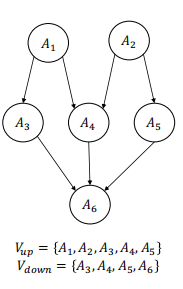
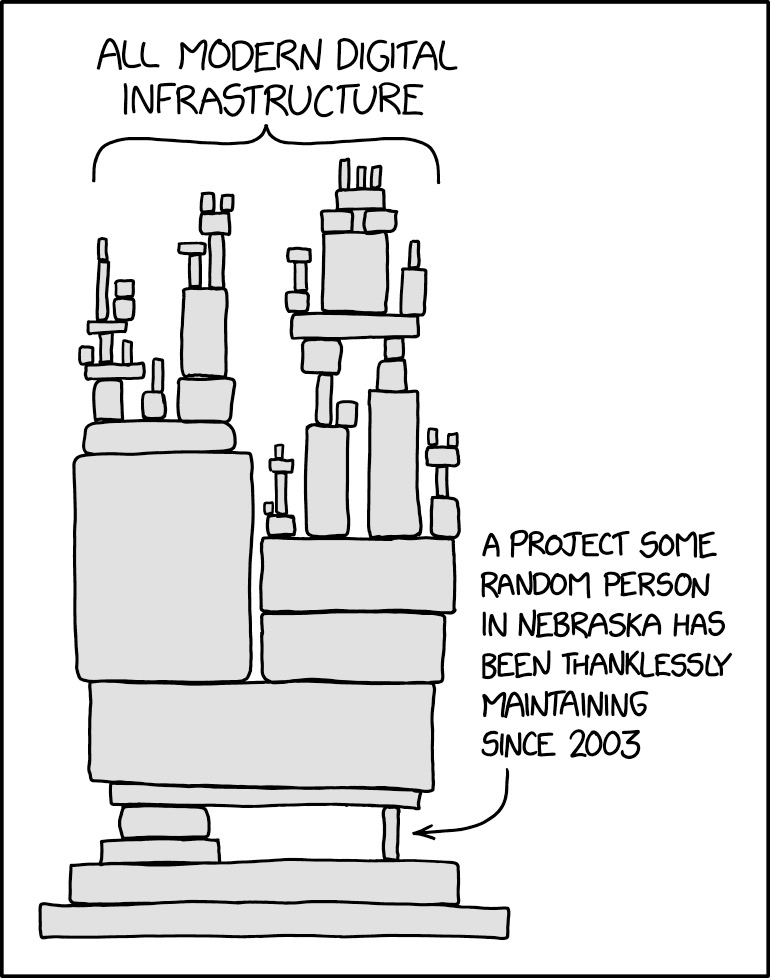

### 包托管平台

**包托管平台**是一个在线的、集中的服务，其主要功能是**存储、分发和管理开源软件包（即代码库）的发布版本**。

您可以把它想象成：

- **手机的官方应用商店（如 App Store/Google Play）**：开发者将应用上传到商店，用户从商店搜索、浏览和下载应用。
- **一个巨大的公共图书馆**：作者将书籍（软件包）捐赠给图书馆，读者（开发者）可以根据书名和索引（包名和版本号）来借阅。

**核心要点**：它是一个**服务中心**，是软件包生态系统的**唯一可信源**。

- **普通托管平台（如闲鱼）：** 
  **流程：** 卖家发布一个爱马仕包包 → 买家看中后下单付款到支付宝（托管平台） → 卖家发货 → 买家收到货，检查无误后确认收货 → 支付宝将款项打给卖家。
  **平台角色：** 只做**资金托管**。平台不负责鉴定包包的真假。如果买家收到假货，需要自己发起申诉、提供证据，平台再介入裁决。这对买家的专业能力和精力是很大的考验。
- **包托管平台（如红布林、只二）：**
   **流程：** **卖家寄出：** 卖家将包包寄给平台。**平台“包”鉴定和护理：** 平台**负责**对包包进行专业的**真伪鉴定、成色评估、清洁护理、拍照上架**。这是“包”的核心环节。
  **平台销售和托管：** 平台以统一的标准展示商品，买家下单，款项支付到平台。
  **平台发货：** 平台直接发货给买家。
  **结算：** 买家确认收货后，平台扣除佣金，将款项打给卖家。
  **“包”的体现：** **对买家：** “包正品”。平台用自己的信誉担保商品是真的，买家无需具备鉴定知识。如果事后发现是假货，平台承担全责。
  **对卖家：** “包省心”。卖家不用自己拍照、写描述、应付买家的各种疑问，平台全权负责专业的展示和销售流程。

### 包管理器

一个不仅提供包存储，还**额外承诺并负责处理依赖解析、版本管理和安全验证等关键、复杂或有风险的环节**的第三方工具。它比简单的包下载更进一步，提供了“一站式搞定”的保障。

- **普通包存储库（如简单的软件下载站点）：**
  **流程：** 开发者发布一个软件包 → 用户查找并手动下载包 → 用户自行安装包 → 用户需要自己处理依赖关系、解决冲突并确保兼容性。
  **工具角色：** 只做**包存储**。工具不负责解析依赖或验证安全性。如果用户遇到依赖冲突、版本不匹配或安全漏洞，需要自行调试和解决。这对用户的技术能力和时间精力是很大的考验。
- **包管理器（如npm、pip）：**
  **流程：** **开发者发布：** 开发者将包发布到管理器。**管理器“包”依赖和版本：** 管理器**负责**对包进行专业的**依赖解析、版本控制、安全扫描和元数据管理**。这是“包”的核心环节。
  **管理器安装和托管：** 管理器以统一的标准处理包安装，用户只需运行安装命令（如`npm install`或`pip install`），款项（即依赖包）自动下载到本地。
  **管理器更新：** 管理器直接处理更新、冲突解决和环境配置。
  **结算：** 用户确认安装后，管理器确保环境稳定，并处理清理工作。
  **“包”的体现：** **对用户：** “包依赖”。管理器用自己的算法和信誉担保依赖正确性，用户无需手动处理复杂依赖关系。如果事后发现冲突或漏洞，管理器提供工具自动修复或回滚。
  **对开发者：** “包分发”。开发者不用关心用户如何安装和处理依赖，管理器全权负责包的标准化分发、版本管理和依赖协调。

### 研究方向定义

一个软件项目的开源软件供应链包括：通过这个项目的包管理器，从开源包托管平台所获取的所有软件包以及软件包之间的依赖关系

+ 为何之研究这部分软件供应链？
  + 易于精确还原   => 可自动化分析 
  + 包数量庞大、包内容高度多样化 => 研究结果的通用性较好
  + 包来源复杂、质量参差不齐、问题更加突出 => 需要供应链管理
  + 存在极端复杂的依赖关系 => 新的研究问题

### 形式化的视角

 好的，结合您提供的图片，我们可以对软件供应链的图模型进行一个非常具体和详细的解释。这张图片完美地图下方明确定义了两个集合：

- `V_up = {A₁, A₂, A₃, A₄, A₅}`（上游节点集合）
- `V_down = {A₃, A₄, A₅, A₆}`（下游节点集合）

#### 1. 理解依赖关系（边 E）

箭头所表示的**依赖关系**。每个箭头都意味着“依赖”。

**一个生动的例子**：

- A₁ 可能是 “**数据库驱动库**”
- A₂ 可能是 “**网络请求库**”
- A₃ 可能是 “**用户认证服务**”（它需要数据库驱动 A₁ 来读写用户数据）
- A₄ 可能是 “**数据查询服务**”（它需要数据库驱动 A₁ 和网络库 A₂ 来接收和处理请求）
- A₅ 可能是 “**文件上传服务**”（它需要网络库 A₂）
- A₆ 可能是 “**我的最终应用程序**”（它需要认证 A₃、数据查询 A₄ 和文件上传 A₅ 这三个服务才能运行）

#### 2. 理解上游和下游的划分（V_up 和 V_down）

**这个供应链图是针对特定上下文或特定“焦点”而言的。**在这个具体的图中，**集合的划分是以 A₆ 为核心视角的**。

- **为什么 A₃, A₄, A₅ 既在 V_up 也在 V_down？**
  + 对于最终的应用程序 A₆ 来说，A₃、A₄、A₅ 是它**直接依赖**的组件，因此它们是 A₆ 的**上游（V_up）**。 但同时，A₃ 本身又依赖于 A₁，A₄ 依赖于 A₁ 和 A₂，A₅ 依赖于 A₂。从这个角度看，A₃、A₄、A₅ 又是 A₁ 和 A₂ 的**下游（V_down）**。它们在整个链条中扮演了**中间件**的角色。
- **为什么 A₁ 和 A₂ 只在 V_up 中？** 
  + 因为在这个图中，没有任何箭头指向 A₁ 或 A₂。它们是整个依赖链条的**起点**，是最基础、最底层的库，只被他人依赖，而不依赖图中的其他节点。因此，它们纯粹是**上游（V_up）**。
- **为什么 A₆ 只在 V_down 中？**
  + 因为 A₆ 是依赖关系的终点。它依赖于 A₃、A₄、A₅，但没有其他节点依赖于它（图中没有从 A₆ 指出的箭头）。因此，它是纯粹的**下游（V_down）**。

#### 3. 综合解释与供应链风险分析

依赖路径有三条：

1. 1.`A₁ → A₃ → A₆`
2. 2.`A₁ → A₄ → A₆`和 `A₂ → A₄ → A₆`（A₄ 有两个上游）
3. 3.`A₂ → A₅ → A₆`

**供应链安全意义**：

1. **关键上游（Single Point of Failure）**：节点 A₁ 和 A₂ 是**高风险关键点**。因为一旦 A₁ 出现安全漏洞或被植入恶意代码（即“投毒”），这个风险会同时影响 A₃ 和 A₄，并最终传导到最终应用 A₆。A₂ 的问题会同时影响 A₄ 和 A₅，进而影响 A₆。
2. **依赖的深度**：A₆ 并不直接依赖 A₁，但 A₁ 的风险仍然可以通过 A₃ 或 A₄ **间接地**影响到 A₆。这就是所谓的**传递性依赖风险**。在安全管理中，这种间接依赖往往更容易被忽视。
3. **漏洞影响范围**：假设在 A₄ 中发现一个漏洞，那么受影响的直接下游就是 A₆。安全团队可以迅速通过此图定位到受影响的应用。

**注:**

- **依赖是有方向和有层次的**
- **“上游”和“下游”的角色是相对的**
- **可视化是安全管理的关键**

## 开源软件供应链现状

+ 供给端：软件包数量增长
+ 需求端：各个包托管平台的软件包下载量高速增长

### 质量问题

+ **（初级）开发者：**开源的，质量一定很高！

+ **真实情况：**没有测试、缺乏维护、永远0.x版本、API不稳定、总能找出bug…

1. **测试情况：【多数包缺乏测试】**事实：大部分 npm 和 PyPI 简单包没有测试，质量靠用户“用”出来（部署测试）。警示：使用未经测试的包风险极高。
2. **流行度指标：【下载量不代表活跃度】**事实：高下载量不意味着包在被积极维护。警示：流行包可能已无人维护，存在安全隐患。
3. **版本号：【版本号不反映成熟度】**事实：版本号（如 v1.0, v2.0）并不能可靠指示发布的成熟和稳定程度。警示：新大版本不一定更稳定，不要盲目升级。
4. **版本号与兼容性：【版本号不保证兼容性】**事实：约1/3的版本更新会引入破坏性变更，且次要版本和主要版本一样危险。警示：即使是小版本升级，也可能导致代码崩溃，必须谨慎测试。

### 安全漏洞

+ 开源包中存在有可能被恶意利用的Bug

https://www.zscaler.jp/blogs/security-research/weekly-roundup-what-weve-learned-about-log4j-vulnerability

+ 供应链攻击
  

### 可持续性

significant number of (GitHub) projects die in the first year of existence with the survival rate decreasing year after year (Ait et al., MSR 2022)

+ 开源项目失败的原因：
  + 环境因素：
    + **被竞争对手取代**
    + 法律问题、公司收购等也是外部环境导致失败的原因。
  + 项目自身原因：
    + 技术、项目过时
    + 可维护性差
  + 团队因素：
    + 维护者缺乏时间或兴趣
    + 开发者之间的冲突

### 结构脆弱

少量软件包被大量软件包依赖

## 开源软件供应链管理

###  1.三大核心角色

- **上游软件包**：**角色**：开源组件的**生产者**。例如，开发了 `lodash`或 `react`的团队。**职责**：负责规划新功能、修复BUG、然后**发布新版本**，并**上传**到托管平台。
- **包托管平台**：**角色**：软件包的**应用商店**或**仓库**。例如 npmjs.com (JavaScript), PyPI (Python), Maven Central (Java)。**职责**：**审查新版本**：对上传的包进行基本的安全或合规检查。**监控安全漏洞**：维护已知漏洞数据库，向下游发出警报。**软件包搜索/推荐**：帮助开发者找到需要的包。
- **下游软件包/项目**：**角色**：开源组件的**消费者**。例如，你的业务项目或另一个更大的开源库。**职责**：根据需求**选择**合适的包，并**管理**这些依赖（包括**升级**和**移除**）。

### 2. 工作流程（箭头方向）

图表中的箭头清晰地展示了软件包的流动和信息反馈：

- **正向流动（实线箭头）**：“软件包”本身的流动。`上传`-> `下载`：这是最主要的供应链。上游发布包，下游下载使用。
- **反向沟通（虚线箭头）**：“信息”的流动。`下游沟通`：下游用户在使用过程中发现bug或需要新功能时，会向上游反馈（如通过GitHub提交Issue），从而促使上游开始“规划新版本”。这形成了一个重要的反馈闭环。

### 3. 自动化工具支持（图表底部）

这是图表非常关键的一部分，体现了现代软件开发的自动化水平。**这些工具贯穿了上下游，是供应链管理的技术基础。**

- **包管理器**：如 `npm`, `pip`, `Maven`。它根据配置文件（如 `package.json`）自动完成依赖的**下载、升级和移除**。
- **自动依赖管理Bot**：如 Dependabot, Renovate。它们能**自动监控**你所依赖的包是否有新版本或安全更新，并自动创建拉取请求（PR）来帮你升级。
- **CI/CD流水线**：在代码集成和部署流程中，**自动执行**依赖安装、安全漏洞扫描、许可证合规检查等任务，确保供应链安全。

### 4.有研究价值的问题

+ 上下游沟通机制 
  + Release Note

+ 包管理平台
  + 确保新版本里没有恶意代码？
  + 构建机制推荐/选择软件包？

+ 下游软件包/项目
  + 如何选择包依赖？
    +  理论
    + 推荐工具

+ 如何升级包依赖？
  + 检测不兼容变更
  + 适配不兼容变更

+ 对依赖的移除/迁移
  + 理论 & 推荐工具
+ 自动依赖管理Bot
  + 交互设计

+ 供应链&开源可持续性