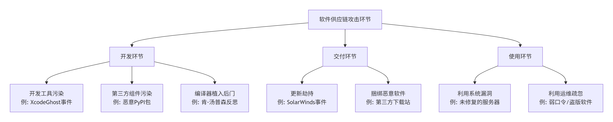

# 相关风险

## 💻 开发环节的攻击

这个阶段的攻击旨在污染软件的“源头”，影响面最广。

- **攻击开发工具**：攻击者会篡改开发者使用的工具。著名的 **XcodeGhost 事件**中，攻击者向开发者分发被植入恶意代码的非官方版 Xcode 开发工具，导致用其开发的大量 App 被感染 。

- **污染第三方组件**：现代软件开发大量使用开源库。攻击者会向公共仓库（如 PyPI、npm）上传名称与正版相似或功能实用的恶意包，或直接劫持已有库的更新流程，从而将恶意代码注入所有依赖该组件的项目 。例如，攻击者曾上传名为 `jeilyfish`的包来模仿正版 `jellyfish`包 。

- **在编译器中植入后门**：这是一种更高级、更隐蔽的攻击。攻击者可能篡改编译器本身，使其在编译软件时悄悄插入恶意代码，即使源代码是干净的，生成的可执行文件也已被感染。Unix 联合创始人肯·汤普森曾著名地反思过这种攻击的可行性 。

## 🚚 交付环节的攻击

这个阶段的攻击目标是软件分发给用户的“通道”。

- **劫持更新过程**：攻击者入侵软件厂商的更新服务器，用植入后门的版本替换合法的软件更新包。**SolarWinds 事件**是典型案例，攻击者通过被污染的 Orion 软件更新包入侵了多家美国政府部门 。

- **捆绑恶意软件**：在一些非官方或缺乏监管的软件下载站，攻击者会将恶意软件与热门软件捆绑在一起，用户在下述安装正版软件时，会无意中同时安装恶意软件 。

## 🔧 使用环节的攻击

这个阶段的攻击主要利用用户（尤其是企业运维人员）的疏忽。

- **利用系统漏洞与暴露面**：如果企业网络边界的安全设备配置不当，将运维接口（如远程管理端口）直接暴露在互联网上，攻击者就可以利用这些系统自身的漏洞发起攻击 。

- **利用运维疏忽**：许多安全事件源于基本的运维疏忽。例如，使用**弱口令**、在服务器上安装**盗版软件**、或明文存储密码和密钥等敏感信息，都会给攻击者大开方便之门 。

## ⚡ 攻击的共性特征

了解这些攻击的共性，有助于理解其为何难以防范：

- **隐蔽性强**：这类攻击利用的是对合法软件和供应商的**信任**。恶意代码被包裹在看似正常的软件中，很容易绕过传统安全软件的检测 。

- **影响面广**：由于软件供应链的连锁效应，攻击一个上游组件或供应商，可以“隔山打牛”地影响到其成千上万的下游用户，造成大规模入侵 。例如，一个流行开源库被污染，可能导致无数依赖它的网站和应用面临风险。

- **攻击门槛多样**：并非所有攻击都需要高超技术。有些攻击（如向公共仓库上传恶意包）成本极低，但可能因为开发者一时疏忽而成功 。
